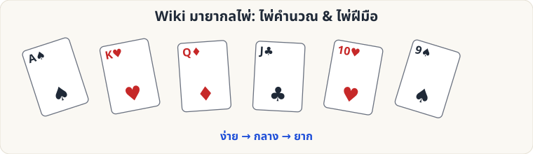

# 🃏 Wiki มายากลไพ่ (Card Magic Wiki)

คู่มือสอนมายากลไพ่ภาษาไทย พร้อมภาพประกอบทุกบทเรียน แบ่งเป็น **2 สาย** และ **3 ระดับ**

| | 🟢 ง่าย | 🟡 กลาง | 🔴 ยาก |
|---|---|---|---|
| **ไพ่คำนวณ** (Self-Working: ใช้หลักคณิตศาสตร์/การจัดลำดับ ไม่ต้องใช้ฝีมือ) | [ไพ่คีย์, ไพ่ 9 ใบ](Self-Working-Easy.md) | [ไพ่ 21 ใบ, Gilbreath, Si Stebbins](Self-Working-Medium.md) | [Fitch–Cheney 5 ใบ, Faro คณิตศาสตร์](Self-Working-Hard.md) |
| **ไพ่ฝีมือ** (Sleight of Hand: ใช้เทคนิคมือ) | [Overhand, Glimpse, Cross-Cut Force](Sleight-Easy.md) | [Double Lift, Hindu Force, Riffle & Bridge](Sleight-Medium.md) | [Classic Pass, Palm, Faro Shuffle](Sleight-Hard.md) |

## เริ่มตรงไหนดี?

1. อ่าน [พื้นฐานและศัพท์](Basics.md) ก่อน (10 นาที)
2. เลือกสายที่สนใจ แล้วไล่จากระดับง่าย → กลาง → ยาก
3. ดู [เส้นทางการเรียนแนะนำ](Learning-Path.md) ถ้าอยากได้แผนฝึกเป็นสัปดาห์

## ไพ่คำนวณ vs ไพ่ฝีมือ ต่างกันอย่างไร

| | ไพ่คำนวณ | ไพ่ฝีมือ |
|---|---|---|
| หลักการ | คณิตศาสตร์ / การจัดสำรับ / หลักการสับ | การควบคุมไพ่ด้วยมือ |
| ต้องฝึกมือ | น้อย–ปานกลาง | มาก |
| ต้องฝึกพูด/จังหวะ | **มาก** (เพราะวิธีการเรียบง่าย ต้องใช้ศิลปะการแสดง) | **มาก** |
| ข้อดี | เริ่มเล่นได้ในวันเดียว สำรับยืมได้ | ผลลัพธ์ดูเหลือเชื่อ ยืดหยุ่น |
| ข้อควรระวัง | ถ้าเล่นซ้ำ คนจับทางได้ง่าย | ฝึกไม่พอ = เห็นเทคนิค |

> ⚠️ **จริยธรรมนักมายากล:** ความสนุกอยู่ที่ "ความอัศจรรย์ใจ" ไม่ใช่การหลอกลวงเอาประโยชน์ อย่านำไปใช้กับการพนัน/การโกงเงิน และอย่าเฉลยวิธีให้ผู้ชมระหว่างการแสดง
