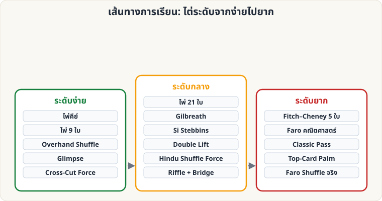

# เส้นทางการเรียนแนะนำ

[← หน้าหลัก](Home.md)

## แผน 8 สัปดาห์ (ฝึกวันละ 15–30 นาที)

| สัปดาห์ | หัวข้อ | เป้าหมาย |
|---|---|---|
| 1 | [พื้นฐาน](Basics.md), [ไพ่คีย์](Self-Working-Easy.md#keycard), [ไพ่ 9 ใบ](Self-Working-Easy.md#nine) | เล่นให้เพื่อนดู 1 กล พร้อมบทพูด |
| 2 | [Overhand](Sleight-Easy.md#overhand), [Glimpse](Sleight-Easy.md#glimpse) | ส่งใบบนสุด↔ล่างสุดได้ โดยไม่มองมือ |
| 3 | [Cross-Cut Force](Sleight-Easy.md#crosscut), [ไพ่ 21 ใบ](Self-Working-Medium.md#twentyone) | เล่นกลทำนายไพ่ได้ต่อเนื่อง 2 กล |
| 4 | [Gilbreath](Self-Working-Medium.md#gilbreath), [Riffle & Bridge](Sleight-Medium.md#riffle) | สับริฟเฟิลเรียบ ไม่กระเด็น |
| 5 | [Double Lift](Sleight-Medium.md#doublelift), [Hindu Force](Sleight-Medium.md#pinkybreak) | พลิก 2 ใบเป็นใบเดียวให้เนียนต่อหน้ากระจก |
| 6 | [Si Stebbins](Self-Working-Medium.md#stebbins) | คำนวณใบถัดไปได้ใน 2 วินาที |
| 7 | [Fitch–Cheney](Self-Working-Hard.md) (ต้องมีเพื่อนช่วย) | ทำได้ถูกต้อง 10 ครั้งติด |
| 8+ | [Classic Pass](Sleight-Hard.md#pass), [Palm](Sleight-Hard.md#palm), [Faro](Sleight-Hard.md#faro) | ฝึกต่อเนื่องหลายเดือน |

## ข้อแนะนำ

- เลือก **1 ไพ่คำนวณ + 1 ไพ่ฝีมือ** ต่อสัปดาห์ ผสมกันจะไม่เบื่อ
- ซ้อมการแสดงจริง (พูด + ทำ) อย่างน้อย 5 รอบก่อนเล่นให้ใครดู
- จดว่าผู้ชมแต่ละคนตอบสนองอย่างไร แล้วปรับบทพูด
