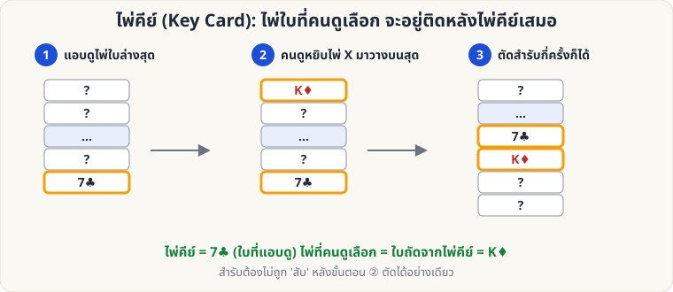
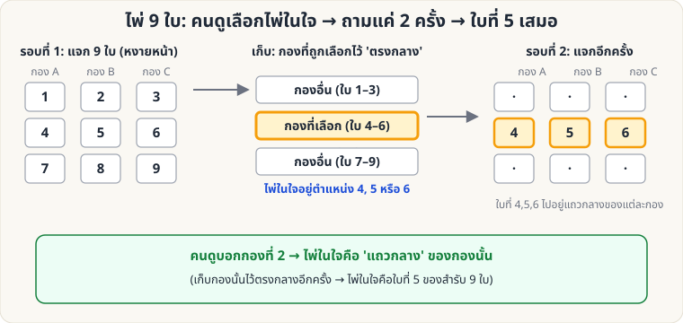

# ไพ่คำนวณ — 🟢 ระดับง่าย

[← หน้าหลัก](Home.md) · [ไประดับกลาง →](Self-Working-Medium.md)

ไพ่คำนวณ (Self-Working) คือกลที่ **ผลลัพธ์เกิดจากหลักการ ไม่ใช่ฝีมือ** ระดับนี้เรียนรู้ได้ในวันเดียว

---

## 1. ไพ่คีย์ (Key Card)

**ผลที่ผู้ชมเห็น:** ผู้ชมเลือกไพ่หนึ่งใบ เสียบกลับในสำรับ ตัดสำรับ แล้วคุณทายไพ่ได้

**อุปกรณ์:** สำรับไพ่ 1 สำรับ

**วิธีทำ**

1. **แอบดูไพ่ใบล่างสุด** ของสำรับ (เช่น 7♣) นี่คือ *ไพ่คีย์* ดูได้ตอนเคาะสำรับให้เรียบ (ดู [Glimpse](Sleight-Easy.md#glimpse))
2. ให้ผู้ชมดึงไพ่ 1 ใบจากสำรับ (X) ดูแล้วจำ
3. ให้ผู้ชมวาง **X ลงบนสุดของสำรับ**
4. ให้ผู้ชม **ตัดสำรับ** กี่ครั้งก็ได้ (ห้ามสับ)
5. ถึงตอนนี้ไพ่คีย์อยู่ **ติดข้างบน X เสมอ** (ลำดับ ...7♣, X...) เพราะการตัดสำรับเพียงย้ายจุดตัด แต่ลำดับวนต่อกัน
6. หงายไพ่เรียงทีละใบ เมื่อเจอ 7♣ ใบถัดไปคือไพ่ของผู้ชม

**ทำให้ดีขึ้น**

- อย่าเปิดเผยทันที: เปิดไพ่ขึ้นมาทีละใบ "อ่านใจ" แล้วหยุดที่ใบที่ต้องการ
- เปลี่ยนแนวการเปิดเผย เช่น วางไพ่คีย์ติดโต๊ะ แล้วให้ผู้ชมบอกชื่อไพ่เอง
- ผู้ชมต้อง **ตัดอย่างเดียว ห้ามสับ** ถ้าอยากให้สับได้จริง ให้ดู [Gilbreath](Self-Working-Medium.md#gilbreath) หรือ [Si Stebbins](Self-Working-Medium.md#stebbins)

---

## 2. ไพ่ 9 ใบ (Nine-Card Mind Reading)

**ผลที่ผู้ชมเห็น:** ผู้ชมคิดไพ่ในใจจาก 9 ใบ คุณถามแค่ว่า "อยู่กองไหน" 2 ครั้ง ก็หาไพ่เจอ

**อุปกรณ์:** ไพ่ 9 ใบ (ใบอะไรก็ได้ ไม่ซ้ำ)

**วิธีทำ**

1. แจกไพ่หงายหน้า 9 ใบ เป็น 3 กอง (A, B, C) แจกทีละใบวนไป จะได้กองละ 3 ใบ
2. ให้ผู้ชมคิดไพ่ 1 ใบในใจ และบอกว่าอยู่กองไหน
3. **เก็บไพ่:** วางกองที่ผู้ชมบอก **ไว้ตรงกลาง** ระหว่างอีก 2 กอง (อีก 2 กองอยู่บนและล่าง) เก็บแต่ละกองโดยไม่สลับลำดับไพ่ภายในกอง
4. แจกไพ่หงายหน้าอีกรอบเป็น 3 กอง ให้ผู้ชมบอกกองอีกครั้ง
5. ไพ่ในใจคือ **ใบแถวกลาง** (ใบที่ 2 จาก 3 ใบ) ของกองที่ผู้ชมบอก
   - (ถ้าเก็บกองนั้นไว้ตรงกลางอีกครั้ง ไพ่ในใจจะเป็น **ใบที่ 5** ของสำรับ 9 ใบ — ใช้เปิดเผยทีละใบได้)

**ทำไมถึงได้ผล**

รอบแรก ไพ่ในใจต้องอยู่ที่ตำแหน่ง 4–6 (กองกลาง) แจกรอบ 2 ใบที่ 4, 5, 6 จะตกไปอยู่ **แถวกลาง** ของ 3 กองพอดี (กองละใบ) ดังนั้นพอรู้กอง ก็รู้ไพ่

**ต่อยอด:** เมื่อเข้าใจหลักแล้ว ไปเล่น [ไพ่ 21 ใบ](Self-Working-Medium.md#twentyone) ซึ่งใช้หลักเดียวกันกับสำรับที่ใหญ่ขึ้น
