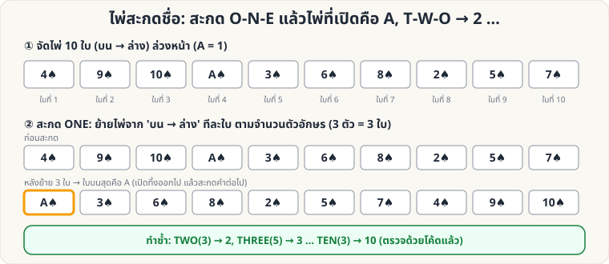
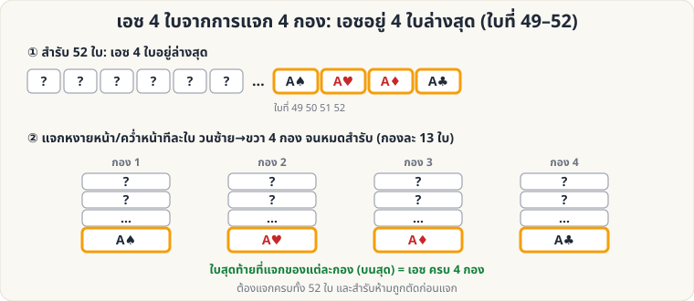
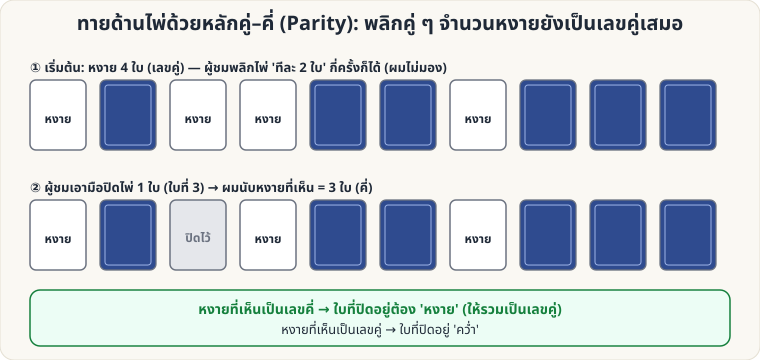

# ไพ่คำนวณ — 🟢 ระดับง่าย

[← หน้าหลัก](Home.md) · [ไประดับกลาง →](Self-Working-Medium.md)

ไพ่คำนวณ (Self-Working) คือกลที่ **ผลลัพธ์เกิดจากหลักการ ไม่ใช่ฝีมือ** ระดับนี้เรียนรู้ได้ในวันเดียว

---

<a id="keycard"></a>

## 1. ไพ่คีย์ (Key Card)

**ผลที่ผู้ชมเห็น:** ผู้ชมเลือกไพ่หนึ่งใบ เสียบกลับในสำรับ ตัดสำรับ แล้วคุณทายไพ่ได้

**อุปกรณ์:** สำรับไพ่ 1 สำรับ


**วิธีทำ**

1. **แอบดูไพ่ใบล่างสุด** ของสำรับ (เช่น 7♣) นี่คือ *ไพ่คีย์* ดูได้ตอนเคาะสำรับให้เรียบ (ดู [Glimpse](Sleight-Easy.md#glimpse))
2. ให้ผู้ชมดึงไพ่ 1 ใบจากสำรับ (X) ดูแล้วจำ
3. ให้ผู้ชมวาง **X ลงบนสุดของสำรับ**
4. ให้ผู้ชม **ตัดสำรับ** กี่ครั้งก็ได้ (ห้ามสับ)
5. ถึงตอนนี้ไพ่คีย์อยู่ **ติดข้างบน X เสมอ** (ลำดับ ...7♣, X...) เพราะการตัดสำรับเพียงย้ายจุดตัด แต่ลำดับวนต่อกัน
6. หงายไพ่เรียงทีละใบ เมื่อเจอ 7♣ ใบถัดไปคือไพ่ของผู้ชม

**ทำให้ดีขึ้น**

- อย่าเปิดเผยทันที: เปิดไพ่ขึ้นมาทีละใบ "อ่านใจ" แล้วหยุดที่ใบที่ต้องการ
- เปลี่ยนแนวการเปิดเผย เช่น วางไพ่คีย์ติดโต๊ะ แล้วให้ผู้ชมบอกชื่อไพ่เอง
- ผู้ชมต้อง **ตัดอย่างเดียว ห้ามสับ** ถ้าอยากให้สับได้จริง ให้ดู [Gilbreath](Self-Working-Medium.md#gilbreath) หรือ [Si Stebbins](Self-Working-Medium.md#stebbins)

---

<a id="nine"></a>

## 2. ไพ่ 9 ใบ (Nine-Card Mind Reading)

**ผลที่ผู้ชมเห็น:** ผู้ชมคิดไพ่ในใจจาก 9 ใบ คุณถามแค่ว่า "อยู่กองไหน" 2 ครั้ง ก็หาไพ่เจอ

**อุปกรณ์:** ไพ่ 9 ใบ (ใบอะไรก็ได้ ไม่ซ้ำ)


**วิธีทำ**

1. แจกไพ่หงายหน้า 9 ใบ เป็น 3 กอง (A, B, C) แจกทีละใบวนไป จะได้กองละ 3 ใบ
2. ให้ผู้ชมคิดไพ่ 1 ใบในใจ และบอกว่าอยู่กองไหน
3. **เก็บไพ่:** วางกองที่ผู้ชมบอก **ไว้ตรงกลาง** ระหว่างอีก 2 กอง (อีก 2 กองอยู่บนและล่าง) เก็บแต่ละกองโดยไม่สลับลำดับไพ่ภายในกอง
4. แจกไพ่หงายหน้าอีกรอบเป็น 3 กอง ให้ผู้ชมบอกกองอีกครั้ง
5. ไพ่ในใจคือ **ใบแถวกลาง** (ใบที่ 2 จาก 3 ใบ) ของกองที่ผู้ชมบอก
   - (ถ้าเก็บกองนั้นไว้ตรงกลางอีกครั้ง ไพ่ในใจจะเป็น **ใบที่ 5** ของสำรับ 9 ใบ — ใช้เปิดเผยทีละใบได้)

**ทำไมถึงได้ผล**

รอบแรก ไพ่ในใจต้องอยู่ที่ตำแหน่ง 4–6 (กองกลาง) แจกรอบ 2 ใบที่ 4, 5, 6 จะตกไปอยู่ **แถวกลาง** ของ 3 กองพอดี (กองละใบ) ดังนั้นพอรู้กอง ก็รู้ไพ่

**ต่อยอด:** เมื่อเข้าใจหลักแล้ว ไปเล่น [ไพ่ 21 ใบ](Self-Working-Medium.md#twentyone) ซึ่งใช้หลักเดียวกันกับสำรับที่ใหญ่ขึ้น

---

<a id="spelling"></a>

## 3. ไพ่สะกดชื่อ (Spelling Trick)

**ผลที่ผู้ชมเห็น:** คุณสะกด "O-N-E" แล้วเปิดไพ่ได้ **A** สะกด "T-W-O" เปิดได้ **2** … ไล่ไปถึง **10** โดยไม่พลาดสักครั้ง

**อุปกรณ์:** ไพ่ 10 ใบ (A ถึง 10 ดอกเดียวกันก็ได้ ให้ดูสวย) จัดเรียงล่วงหน้า



**การจัดสำรับ (บน → ล่าง, คว่ำหน้า)**

```
4  9  10  A  3  6  8  2  5  7
```

**วิธีเล่น**

1. ถือไพ่ 10 ใบคว่ำหน้า สะกดคำว่า **O-N-E** โดย **ย้ายไพ่จากบนสุดไปไว้ล่างสุดทีละใบ ตามตัวอักษร** (3 ตัว = 3 ใบ)
2. **หงายไพ่ใบบนสุดของกองที่เหลือ** → เป็น **A** วางทิ้งไว้บนโต๊ะ (หงายหน้า)
3. สะกด **T-W-O** (3 ใบ) แล้วหงายใบบนสุด → **2**
4. ทำต่อ: THREE (5) → 3, FOUR (4) → 4, FIVE (4) → 5, SIX (3) → 6, SEVEN (5) → 7, EIGHT (5) → 8, NINE (4) → 9, TEN (3) → 10

**ทำไมถึงได้ผล:** ลำดับข้างต้นคำนวณย้อนกลับจากขั้นตอนการสะกดโดยตรง สคริปต์ [`tools/verify_tricks.py`](tools/verify_tricks.py) จำลองให้ครบทุกคำแล้ว

**ต่อยอด**

- เปลี่ยนจำนวนใบ/คำสะกด (เช่น สะกดชื่อไพ่เต็ม "ACE OF SPADES") ได้ โดยแก้ `WORDS` ในสคริปต์เพื่อคำนวณลำดับใหม่
- เล่นแบบ "เสี่ยงทาย": ให้ผู้ชมเลือกคำที่จะสะกด ด้วยการหยุดที่ชุด A–10 ที่คุณจัดไว้หลายสำรับ
- ท่าทางต้องไม่เร็วเกินไปจนดูเหมือนจำ ใส่ "เสียงสะกดแบบดราม่า" ทุกตัวอักษร

---

<a id="fouraces"></a>

## 4. เอซ 4 ใบจากการแจก 4 กอง

**ผลที่ผู้ชมเห็น:** ผู้ชมแจกไพ่ลงโต๊ะเป็น 4 กอง จนหมดสำรับ แล้วเปิดใบบนสุดของแต่ละกอง ก็ได้ **เอซครบ 4 ใบ** ราวกับถูกเรียกมา

**อุปกรณ์:** สำรับ 52 ใบ จัดให้ **เอซ 4 ใบอยู่ล่างสุด** (ใบที่ 49–52, เรียงดอกไหนก็ได้)



**วิธีเล่น**

1. ถือสำรับที่จัดเอซไว้ล่างสุด พูดบทเปิดเรื่องเอซ (เช่น "เอซคือผู้นำของไพ่")
2. ยื่นสำรับให้ผู้ชม แล้วบอกให้ **แจกไพ่ทีละใบ** ลงโต๊ะเป็น **4 กอง** วนซ้าย → ขวา จนหมดสำรับ
3. ใบสุดท้ายที่แจก (ใบที่ 49–52) ตกเป็นใบ **บนสุด** ของ 4 กองพอดี
4. ให้ผู้ชมหยิบ "ใบบนสุด" ของแต่ละกองขึ้นมาเปิด → **เอซครบ 4 ใบ**

**ข้อควรระวัง**

- สำรับ **ห้ามตัดและห้ามสับ** ก่อนแจก (ตัดผิดจุดเอซจะไม่ตกที่ใบบนสุด)
- ต้องแจกให้ครบ **ทั้ง 52 ใบ** (จำนวนต้องหาร 4 ลงตัว)
- เพราะแจกแล้วเห็นเอซง่ายมาก ให้ **เบี่ยงเบนความสนใจ** ด้วยการพูด/ให้ผู้ชมเลือก "กองโปรด" ก่อนเปิด

**ต่อยอด:** ถ้าเอซอยู่ **บนสุด** 4 ใบ ให้ใช้ [Overhand Shuffle](Sleight-Easy.md#overhand) ดึงเอซออกมา **ทีละใบ 4 ครั้งแรก** แล้วสับส่วนที่เหลือต่อ เอซจะลงไปอยู่ล่างสุดให้เล่นกลนี้ได้

---

<a id="parity"></a>

## 5. ทายด้านไพ่ด้วยหลักคู่–คี่ (Parity)

**ผลที่ผู้ชมเห็น:** ไพ่ 10 ใบคว่ำ/หงายปะปน ผู้ชมพลิกไพ่ "ทีละ 2 ใบ" หลายครั้ง ขณะที่คุณ **ไม่มอง** จากนั้นผู้ชมเอามือปิดไพ่ 1 ใบ แต่คุณบอกได้ว่าใบที่ปิด **คว่ำหรือหงาย**

**อุปกรณ์:** ไพ่ 10 ใบ (ใบอะไรก็ได้)



**วิธีเล่น**

1. วางไพ่ 10 ใบเป็นแถวบนโต๊ะ ให้ **หงาย 4 ใบ** (หรือจำนวนคู่ใดก็ได้ เช่น 0, 2, 4, …) ที่เหลือคว่ำ
2. บอกผู้ชมว่า "ฉันจะหันหลัง ให้คุณ **พลิกไพ่ครั้งละ 2 ใบ** เมื่อไรก็ได้ กี่รอบก็ได้ เสร็จแล้วบอกฉัน"
3. หันกลับมา ผู้ชม **เอามือปิดไพ่ 1 ใบ** (ใบไหนก็ได้)
4. คุณนับ **ไพ่หงายที่เห็น**:
   - เป็น **เลขคี่** → ใบที่ปิดอยู่ **หงาย**
   - เป็น **เลขคู่** → ใบที่ปิดอยู่ **คว่ำ**

**ทำไมถึงได้ผล:** การพลิก 2 ใบ ทำให้จำนวนไพ่หงายเปลี่ยนทีละ −2, 0 หรือ +2 → **ความเป็นคู่/คี่ของจำนวนไพ่หงายไม่เปลี่ยน** จึงเป็นเลขคู่ตลอด ถ้าจำนวนที่เห็นเป็นคี่ ใบที่ปิดต้องหงายเพื่อให้รวมเป็นคู่

**ต่อยอด**

- ปิดไพ่ได้ **หลายใบ** (เห็นเฉพาะที่เหลือ) ก็ทายได้ แค่รู้ว่า "ใบที่ปิดรวมกัน" มีหงายจำนวนคู่หรือคี่
- ใช้ไพ่ 13 ใบ หรือ 12 ใบได้ — ต้องให้จำนวนหงายตอนเริ่มเป็นเลขคู่
- ใช้สีไพ่แทน: คว่ำ = "สีดำ", หงาย = "สีแดง" ในบทพูด ฯลฯ

[ไประดับกลาง →](Self-Working-Medium.md)
