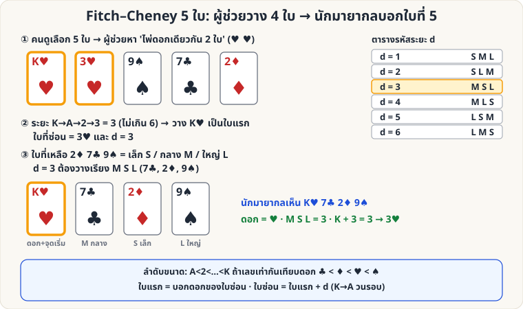
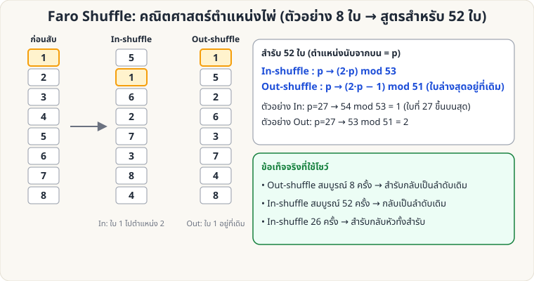

# ไพ่คำนวณ — 🔴 ระดับยาก

[← ระดับกลาง](Self-Working-Medium.md) · [หน้าหลัก](Home.md)

ระดับนี้ต้องใช้ **การคำนวณในใจ + ความจำ** และมักต้องมี **ผู้ช่วย (ผู้ร่วมแสดง)** หรือฝึกมือพื้นฐานเพิ่ม

---

## 1. Fitch–Cheney 5-Card Trick

**ผลที่ผู้ชมเห็น:** ผู้ชมเลือกไพ่ 5 ใบจากสำรับ ผู้ช่วยดูแล้วยื่นไพ่ 4 ใบให้นักมายากลทีละใบ (หงายหน้า) นักมายากลบอกไพ่ใบที่ 5 ที่ผู้ช่วยถืออยู่ได้ — โดย **ไม่มีสัญญาณอื่นนอกจากไพ่ 4 ใบ**

**อุปกรณ์:** สำรับ 52 ใบ, ผู้ช่วย 1 คน

### กฎ

**ลำดับขนาดไพ่:** เลข A<2<…<10<J<Q<K ถ้าเลขเท่ากันให้เทียบดอก **♣ < ♦ < ♥ < ♠** (ตามตัวอักษร C, D, H, S)

**สำหรับผู้ช่วย (เข้ารหัส)**

1. ใน 5 ใบ ต้องมี **ไพ่ดอกเดียวกัน 2 ใบ** เสมอ (หลักช่องนกพิราบ: 5 ใบ 4 ดอก)
2. นับระยะ "วนรอบ" ระหว่างทั้งสองใบ (A→2→…→K→A วนต่อ) เลือกให้ **ระยะ d ≤ 6** — เลือกใบหนึ่งเป็น **ใบแรก** แล้วนับ +d ไปถึงอีกใบ = **ใบที่ซ่อน**
   - ทำได้เสมอ เพราะสองทิศรวมกัน = 13 ดังนั้นอย่างน้อยหนึ่งทิศ ≤ 6
3. ยื่น **ใบแรก** ก่อน (บอกดอกของใบซ่อน และจุดเริ่มนับ)
4. ใบที่เหลือ 3 ใบ เรียงตามขนาดเป็น **S (เล็ก), M (กลาง), L (ใหญ่)** แล้ววางเรียงตามรหัส:

| d | ลำดับที่วาง |
|---|---|
| 1 | S M L |
| 2 | S L M |
| 3 | M S L |
| 4 | M L S |
| 5 | L S M |
| 6 | L M S |

**สำหรับนักมายากล (ถอดรหัส)**

1. ใบแรก → รู้ **ดอก** ของใบซ่อน
2. ดูใบที่เหลือ 3 ใบ เรียงว่าเล็ก/กลาง/ใหญ่ → อ่านรหัส d
3. ใบซ่อน = **เลขของใบแรก + d** (K+1 = A)

**ตัวอย่าง (ตามภาพ)**: ไพ่ 5 ใบ = K♥ 3♥ 9♠ 7♣ 2♦ → คู่ ♥: K→3 ระยะ 3 → ใบแรก = K♥ ซ่อน 3♥ → 2♦ 7♣ 9♠ = S M L → d=3 = M S L → วาง K♥, 7♣, 2♦, 9♠ → ผู้รับได้: ♥ + (M S L=3) → K+3 = 3♥ ✓

**เคล็ดลับ**

- จำตารางรหัสเป็นรูปแบบ: d=1 เรียงปกติ (เล็ก-กลาง-ใหญ่) แล้วไล่สลับตามตารางทีละแบบ ฝึกด้วยแฟลชการ์ด 6 ใบ
- เกม: ผู้ชมเลือก 5 ใบ → ขอให้ผู้ช่วย "ส่งพลังจิต" ผ่านไพ่ทีละใบ แล้วทายอย่างตื่นเต้น
- อย่าให้ผู้ชมมองเห็นผู้ช่วยกับนักมายากลคุยกัน — ไม่มีสัญญาณอื่นใด นอกจากไพ่

---

## 2. Faro Shuffle: คณิตศาสตร์ตำแหน่งไพ่

Faro Shuffle คือการสับ **แบ่งครึ่ง 26/26 แล้วสอดสลับทีละใบพอดี** ทำให้ตำแหน่งของทุกใบ "ทำนายได้" ด้วยสูตร — ฝึกฝนเป็นกลคำนวณชั้นสูง (ฝีมือมือจริงดูที่ [Faro Shuffle ลงมือจริง](Sleight-Hard.md#faro))

| ชนิด | ผลลัพธ์ | สูตรตำแหน่ง (สำรับ 52, ตำแหน่ง p นับจากบน) |
|---|---|---|
| **Out-shuffle** | ใบบนสุด/ล่างสุดอยู่ที่เดิม | p → (2p − 1) mod 51 (ใบที่ 52 คงที่) |
| **In-shuffle** | ใบบนสุดลงมาเป็นใบที่ 2 | p → (2p) mod 53 |

**ข้อเท็จจริงที่ใช้โชว์ (ตรวจสอบด้วยโค้ดแล้ว)**

- Out-shuffle สมบูรณ์ **8 ครั้ง** → สำรับกลับเป็นลำดับเดิมทั้งหมด
- In-shuffle สมบูรณ์ **52 ครั้ง** → กลับเป็นลำดับเดิม
- In-shuffle **26 ครั้ง** → สำรับ **กลับด้าน** (ใบบนสุดไปอยู่ล่างสุด)

**ตัวอย่างการใช้:** ให้ผู้ชมเลือกไพ่ที่ตำแหน่ง p ใด ๆ ก็ได้ แล้วคำนวณจำนวน in-shuffle ที่พาไพ่ไปตำแหน่งที่ต้องการ (เช่น สูตร 2^k·p mod 53)

**ทดลองเอง:** รันสคริปต์ [`tools/generate_images.py`](tools/generate_images.py) — ตอนสร้างภาพจะตรวจสูตรข้างต้นด้วยการจำลองสำรับ
