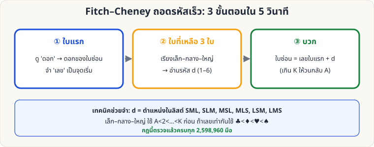
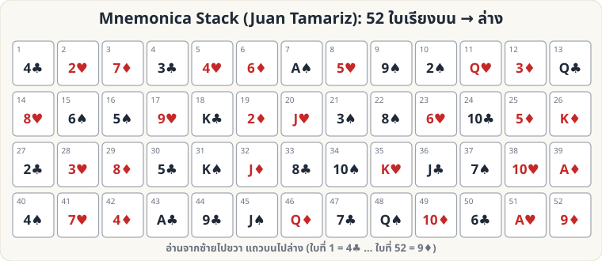
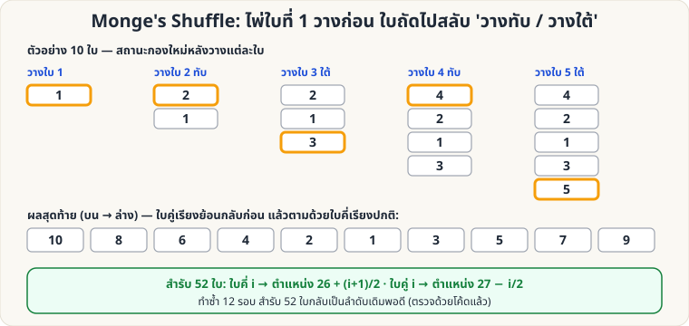

# ไพ่คำนวณ — 🔴 ระดับยาก

[← ระดับกลาง](Self-Working-Medium.md) · [หน้าหลัก](Home.md)

ระดับนี้ต้องใช้ **การคำนวณในใจ + ความจำ** และมักต้องมี **ผู้ช่วย (ผู้ร่วมแสดง)** หรือฝึกมือพื้นฐานเพิ่ม

---

<a id="fitch"></a>

## 1. Fitch–Cheney 5-Card Trick

**ผลที่ผู้ชมเห็น:** ผู้ชมเลือกไพ่ 5 ใบจากสำรับ ผู้ช่วยดูแล้วยื่นไพ่ 4 ใบให้นักมายากลทีละใบ (หงายหน้า) นักมายากลบอกไพ่ใบที่ 5 ที่ผู้ช่วยถืออยู่ได้ — โดย **ไม่มีสัญญาณอื่นนอกจากไพ่ 4 ใบ**

**อุปกรณ์:** สำรับ 52 ใบ, ผู้ช่วย 1 คน


### กฎ

**ลำดับขนาดไพ่:** เลข A<2<…<10<J<Q<K ถ้าเลขเท่ากันให้เทียบดอก **♣ < ♦ < ♥ < ♠** (ตามตัวอักษร C, D, H, S)

**สำหรับผู้ช่วย (เข้ารหัส)**

1. ใน 5 ใบ ต้องมี **ไพ่ดอกเดียวกัน 2 ใบ** เสมอ (หลักช่องนกพิราบ: 5 ใบ 4 ดอก)
2. นับระยะ "วนรอบ" ระหว่างทั้งสองใบ (A→2→…→K→A วนต่อ) เลือกให้ **ระยะ d ≤ 6** — เลือกใบหนึ่งเป็น **ใบแรก** แล้วนับ +d ไปถึงอีกใบ = **ใบที่ซ่อน**
   - ทำได้เสมอ เพราะสองทิศรวมกัน = 13 ดังนั้นอย่างน้อยหนึ่งทิศ ≤ 6
3. ยื่น **ใบแรก** ก่อน (บอกดอกของใบซ่อน และจุดเริ่มนับ)
4. ใบที่เหลือ 3 ใบ เรียงตามขนาดเป็น **S (เล็ก), M (กลาง), L (ใหญ่)** แล้ววางเรียงตามรหัส:

| d | ลำดับที่วาง |
|---|---|
| 1 | S M L |
| 2 | S L M |
| 3 | M S L |
| 4 | M L S |
| 5 | L S M |
| 6 | L M S |

**สำหรับนักมายากล (ถอดรหัส)**

1. ใบแรก → รู้ **ดอก** ของใบซ่อน
2. ดูใบที่เหลือ 3 ใบ เรียงว่าเล็ก/กลาง/ใหญ่ → อ่านรหัส d
3. ใบซ่อน = **เลขของใบแรก + d** (K+1 = A)

**ตัวอย่าง (ตามภาพ)**: ไพ่ 5 ใบ = K♥ 3♥ 9♠ 7♣ 2♦ → คู่ ♥: K→3 ระยะ 3 → ใบแรก = K♥ ซ่อน 3♥ → 2♦ 7♣ 9♠ = S M L → d=3 = M S L → วาง K♥, 7♣, 2♦, 9♠ → ผู้รับได้: ♥ + (M S L=3) → K+3 = 3♥ ✓

**เคล็ดลับ**

- จำตารางรหัสเป็นรูปแบบ: d=1 เรียงปกติ (เล็ก-กลาง-ใหญ่) แล้วไล่สลับตามตารางทีละแบบ ฝึกด้วยแฟลชการ์ด 6 ใบ
- เกม: ผู้ชมเลือก 5 ใบ → ขอให้ผู้ช่วย "ส่งพลังจิต" ผ่านไพ่ทีละใบ แล้วทายอย่างตื่นเต้น
- อย่าให้ผู้ชมมองเห็นผู้ช่วยกับนักมายากลคุยกัน — ไม่มีสัญญาณอื่นใด นอกจากไพ่

---

<a id="faro-math"></a>

## 2. Faro Shuffle: คณิตศาสตร์ตำแหน่งไพ่

Faro Shuffle คือการสับ **แบ่งครึ่ง 26/26 แล้วสอดสลับทีละใบพอดี** ทำให้ตำแหน่งของทุกใบ "ทำนายได้" ด้วยสูตร — ฝึกฝนเป็นกลคำนวณชั้นสูง (ฝีมือมือจริงดูที่ [Faro Shuffle ลงมือจริง](Sleight-Hard.md#faro))


| ชนิด | ผลลัพธ์ | สูตรตำแหน่ง (สำรับ 52, ตำแหน่ง p นับจากบน) |
|---|---|---|
| **Out-shuffle** | ใบบนสุด/ล่างสุดอยู่ที่เดิม | p → (2p − 1) mod 51 (ใบที่ 52 คงที่) |
| **In-shuffle** | ใบบนสุดลงมาเป็นใบที่ 2 | p → (2p) mod 53 |

**ข้อเท็จจริงที่ใช้โชว์ (ตรวจสอบด้วยโค้ดแล้ว)**

- Out-shuffle สมบูรณ์ **8 ครั้ง** → สำรับกลับเป็นลำดับเดิมทั้งหมด
- In-shuffle สมบูรณ์ **52 ครั้ง** → กลับเป็นลำดับเดิม
- In-shuffle **26 ครั้ง** → สำรับ **กลับด้าน** (ใบบนสุดไปอยู่ล่างสุด)

**ตัวอย่างการใช้:** ให้ผู้ชมเลือกไพ่ที่ตำแหน่ง p ใด ๆ ก็ได้ แล้วคำนวณจำนวน in-shuffle ที่พาไพ่ไปตำแหน่งที่ต้องการ (เช่น สูตร 2^k·p mod 53)

**ทดลองเอง:** รันสคริปต์ [`tools/generate_images.py`](tools/generate_images.py) — ตอนสร้างภาพจะตรวจสูตรข้างต้นด้วยการจำลองสำรับ

---

<a id="fitch-drill"></a>

## 3. Fitch–Cheney: ฝึกถอดรหัสเร็ว

เมื่อทำตามหน้า [Fitch–Cheney](#fitch) ได้แล้ว ขั้นต่อไปคือ **ถอดรหัสให้ทันที (ไม่ต้องคิดนาน)**



**ตรวจสอบกฎแล้วครบทุกมือ:** สคริปต์ [`tools/verify_tricks.py --fitch`](tools/verify_tricks.py) เข้ารหัส/ถอดรหัสไพ่ทุกมือที่เป็นไปได้ **2,598,960 มือ** — ถอดได้ถูกต้อง 100% (รวมกรณีมีไพ่ดอกเดียวกัน 3–4 ใบ, เลขซ้ำกัน, และ K→A วนรอบ)

**กรณีพิเศษที่ต้องจำ**

| สถานการณ์ | ทำอย่างไร |
|---|---|
| ดอกเดียวกัน 3 ใบขึ้นไป | เลือกคู่ใดก็ได้ที่ระยะ ≤ 6 (ทางใดทางหนึ่งเสมอ) |
| ไพ่เลขเท่ากัน (เช่น 7♣ 7♦) ในกลุ่ม S/M/L | เทียบดอก ♣ < ♦ < ♥ < ♠ |
| ใบแรกคือ K, ใบซ่อนคือ 3 | K→A→2→3 = ระยะ 3 (วนรอบ) |

**แบบฝึกหัด (ไพ่ 4 ใบที่ผู้ช่วยวาง → ใบที่ 5 คืออะไร?)** — เฉลยอยู่ขวามือ

| ข้อ | ไพ่ 4 ใบ (ตามลำดับที่วาง) | เฉลย (ใบซ่อน) |
|---|---|---|
| 1 | 6♣  2♠  2♥  J♦ | 9♣ |
| 2 | 4♥  10♠  9♠  7♥ | 10♥ |
| 3 | Q♥  9♠  10♣  K♦ | K♥ |
| 4 | 10♦  8♠  8♣  K♣ | K♦ |
| 5 | 4♠  2♠  2♦  A♣ | 10♠ |

อยากได้โจทย์ใหม่ไม่จำกัด: `python3 wiki/tools/fitch_drill.py 10 --answer`

**เกณฑ์ที่ควรไปถึงก่อนเล่นจริง:** ถอดถูก 10 ข้อติดภายใน 5 วินาที/ข้อ

---

<a id="mnemonica"></a>

## 4. Mnemonica Stack (สำรับท่องจำ)

**แนวคิด:** จัดสำรับตามลำดับที่ **ท่องจำได้ทั้ง 52 ใบ** (คิดโดย Juan Tamariz ในหนังสือ *Mnemonica*, 1986) แล้วเล่นกลตั้งแต่ "ผู้ชมบอกชื่อไพ่ → คุณหาใบนั้นได้ทันที" ไปจนถึง "ผู้ชมบอกเลข → คุณบอกไพ่ที่ตำแหน่งนั้น"



**ลำดับสำรับ (บน → ล่าง)**

```
4♣ 2♥ 7♦ 3♣ 4♥ 6♦ A♠ 5♥ 9♠ 2♠ Q♥ 3♦ Q♣
8♥ 6♠ 5♠ 9♥ K♣ 2♦ J♥ 3♠ 8♠ 6♥ 10♣ 5♦ K♦
2♣ 3♥ 8♦ 5♣ K♠ J♦ 8♣ 10♠ K♥ J♣ 7♠ 10♥ A♦
4♠ 7♥ 4♦ A♣ 9♣ J♠ Q♦ 7♣ Q♠ 10♦ 6♣ A♥ 9♦
```

(ตรวจแล้ว: ครบ 52 ใบไม่ซ้ำ)

**ท่องจำอย่างไร**

1. **แบ่งเป็นกลุ่มละ 13** และจำทีละกลุ่ม อย่าจำ 52 ใบรวดเดียว
2. **ผูกภาพ**: ทุกใบกับตำแหน่ง เช่น ใบที่ 1 = 4♣ ให้นึกเป็น "สี่เหลี่ยมสีเขียวที่ประตูทางเข้า" ฯลฯ — วิธีที่ได้ผลสูงสุดคือ "เรื่องเล่า/ลูกโซ่ภาพ" ที่ต่อกันทีละใบ
3. **ฝึกสองทิศ**: ตำแหน่ง → ไพ่ และ ไพ่ → ตำแหน่ง (ใช้ [`tools/mnemonica_drill.py`](tools/mnemonica_drill.py))
4. ทบทวน **ทุกวัน 10 นาที** เป็นเวลา 2–4 สัปดาห์

**ตัวช่วยฝึก:** `python3 wiki/tools/mnemonica_drill.py mnemonica 20` ถามตำแหน่ง/ไพ่สลับกัน (ใช้ `stebbins` แทนได้สำหรับ [Si Stebbins](Self-Working-Medium.md#stebbins))

**ใช้งานอย่างไร**

| กล | วิธีการ |
|---|---|
| ผู้ชมบอกชื่อไพ่ ให้คุณทายตำแหน่ง | รู้ตำแหน่งจากความจำ → นับ/ตัดสำรับไปถึงใบนั้น |
| ผู้ชมบอกเลข ให้คุณทายไพ่ | ท่องตำแหน่ง → ตอบทันที |
| ผู้ชมตัดสำรับ แล้วคุณคืนลำดับ | **หาไพ่ 9♦ (ใบล่างสุดเดิม)** แล้วตัดให้ 9♦ อยู่ล่างสุดอีกครั้ง → ลำดับเดิมกลับมาทั้งสำรับ (เพราะการตัดเพียงหมุนลำดับเป็นวงกลม) |
| ใช้ร่วมกับ Faro | In/Out-shuffle ตามสูตรใน [หน้าที่ 2](#faro-math) แล้วคำนวณตำแหน่งใหม่ |

**ข้อควรระวัง**

- **ห้ามสับ** สำรับระหว่างเล่น: ต้องใช้ "ตัดสำรับ" หรือ False Shuffle/False Cut ที่รักษาลำดับ (ต้องเรียนแยก)
- ใช้เวลาท่องจำมาก แต่เมื่อจำได้แล้ว **ทุกกลใช้สำรับเดียว**

---

<a id="monge"></a>

## 5. Monge's Shuffle

**แนวคิด:** วิธีสับที่ "ดูเหมือนสับธรรมดา" แต่คำนวณตำแหน่งไพ่ได้แน่นอนทุกใบ และเมื่อทำครบ **12 รอบ** สำรับ 52 ใบกลับเป็นลำดับเดิม (ผู้ชมคิดว่าสับจนมั่ว)



**วิธีสับ (Monge)**

1. ถือสำรับคว่ำในมือซ้าย ใช้มือขวาดึงไพ่ทีละใบมาวางบนโต๊ะ
2. ใบที่ 1 วางลงโต๊ะ → ใบที่ 2 **วางทับด้านบน** → ใบที่ 3 **วางใต้** → ใบที่ 4 วางทับ → ใบที่ 5 วางใต้ … สลับ ทับ/ใต้ จนหมดสำรับ
3. ผลลัพธ์: **ใบคู่เรียงกลับด้าน (บน)** ตามด้วย **ใบคี่เรียงปกติ (ล่าง)**

**สูตรตำแหน่ง (สำรับ 52 ใบ ตำแหน่ง i นับจากบน)**

- ใบคี่ i → ไปอยู่ตำแหน่ง **26 + (i+1)/2**
- ใบคู่ i → ไปอยู่ตำแหน่ง **27 − i/2**

**ข้อเท็จจริงที่ตรวจด้วยโค้ดแล้ว**

- สำรับ 52 ใบ ต้องทำ Monge **12 รอบ** จึงกลับลำดับเดิม
- ไพ่ในสำรับแบ่งเป็น **วงรอบ** ความยาว 12, 12, 12, 6, 4, 3, 2, 1 (รวม 52) — ไพ่ในวงรอบเดียวกับตำแหน่งที่ 1 (12 ตำแหน่ง) เท่านั้น ที่นำขึ้นมาบนสุดได้ด้วยการสับซ้ำ

**ตารางนำไพ่ขึ้นบนสุด** (ไพ่ที่อยู่ตำแหน่ง *p* ก่อนสับ → ต้อง Monge กี่รอบจึงขึ้นมาอยู่บนสุด)

| จำนวนรอบ | ตำแหน่ง p ก่อนสับ |
|---|---|
| 1 | 52 |
| 2 | 51 |
| 3 | 49 |
| 4 | 45 |
| 5 | 37 |
| 6 | 21 |
| 7 | 12 |
| 8 | 30 |
| 9 | 7 |
| 10 | 40 |
| 11 | 27 |

เช่น **ไพ่ล่างสุด (ตำแหน่ง 52) ขึ้นบนสุดใน 1 รอบ** · ไพ่ตำแหน่งที่ 51 ขึ้นใน 2 รอบ

**ใช้เล่นอย่างไร**

- **กลทายไพ่ล่างสุด**: ให้ผู้ชมเห็นและจำไพ่ใบล่าง (หรือ Glimpse) → Monge 1 รอบ → ใบนั้นอยู่บนสุดแน่นอน
- **กลสับครบ 12 รอบ**: "ฉันสับหนักมาก (12 ครั้ง)" แต่สำรับกลับมาเรียง Mnemonica/Stebbins เดิม
- ฝึกด้วยมือ 10 ใบก่อน (ตามภาพ) แล้วค่อยเป็น 52 ใบ

---

กลับไป [หน้าหลัก](Home.md)
