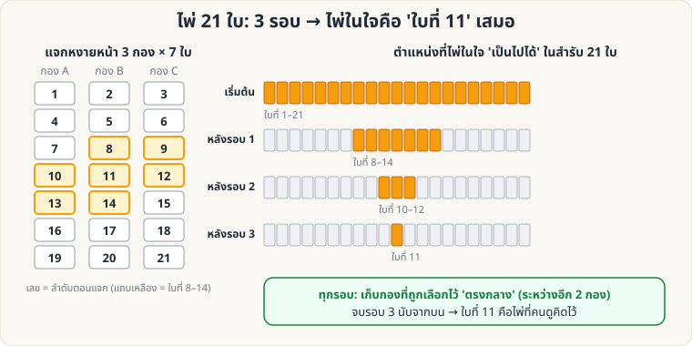
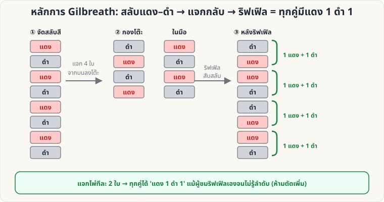
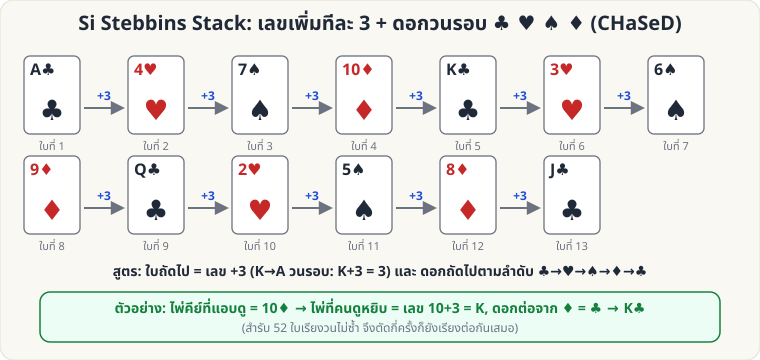
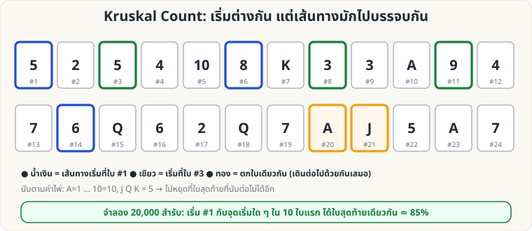
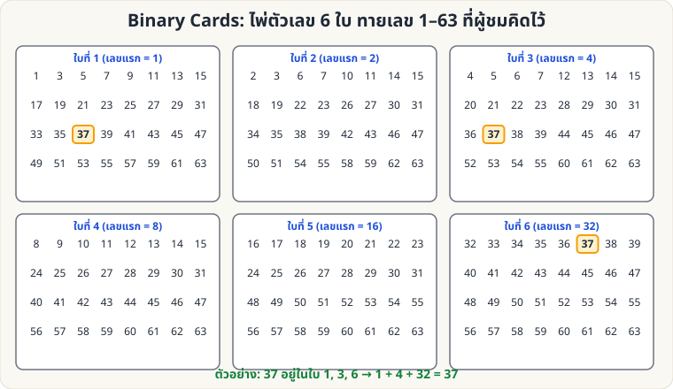
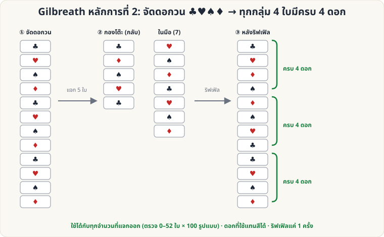

# ไพ่คำนวณ — 🟡 ระดับกลาง

[← ระดับง่าย](Self-Working-Easy.md) · [หน้าหลัก](Home.md) · [ไประดับยาก →](Self-Working-Hard.md)

---

<a id="twentyone"></a>

## 1. ไพ่ 21 ใบ (21-Card Trick)

**ผลที่ผู้ชมเห็น:** ผู้ชมคิดไพ่ในใจจาก 21 ใบ ตอบเพียง "อยู่กองไหน" 3 ครั้ง คุณเปิดไพ่ที่คิดไว้ได้

**อุปกรณ์:** ไพ่ 21 ใบ (สุ่มจากสำรับ)



**วิธีทำ**

1. แจกไพ่หงายหน้าทีละใบเป็น 3 กอง กองละ 7 ใบ (ให้เห็นหน้าทุกใบ)
2. ผู้ชมคิดไพ่ 1 ใบ แล้วบอกว่าอยู่กองไหน
3. เก็บไพ่โดย **วางกองที่ถูกเลือกไว้ตรงกลาง** ระหว่างอีก 2 กอง จากนั้นพลิกสำรับเป็นคว่ำ แล้วแจกซ้ำ (หงายหน้าทีละใบ)
4. ทำซ้ำรวม **3 รอบ**
5. หลังเก็บไพ่รอบที่ 3 ไพ่ในใจจะอยู่ **ใบที่ 11 พอดี** — เปิดทีละใบด้วยบทพูดที่สนุก

**ทำไมถึงได้ผล:** ภาพด้านบนแสดงตำแหน่งที่ "เป็นไปได้" แคบลงเรื่อย ๆ: 21 → 8–14 → 10–12 → 11

**ต่อยอด**

- ใช้ **27 ใบ** ก็ได้ (3 กอง × 9 ใบ, 3 รอบ → ใบที่ 14 เสมอ)
- ให้ผู้ชมเป็นผู้ **แจกเอง** ได้ — คุณแค่บอกว่าต้องวางกองไหนไว้ตรงกลาง

---

<a id="gilbreath"></a>

## 2. หลักการ Gilbreath

**ผลที่ผู้ชมเห็น:** ผู้ชมสับสำรับเองด้วยการสับแบบริฟเฟิล แต่เมื่อแจกเป็นคู่ **ทุกคู่มีไพ่สีแดง 1 ใบและสีดำ 1 ใบ** (หรือ ไพ่อื่น ๆ ที่คุณจัดไว้)

**อุปกรณ์:** สำรับไพ่ที่จัด **แดง/ดำสลับกัน** 52 ใบ (ใบบนสุดสีไหนก็ได้)



**วิธีทำ**

1. จัดสำรับสลับสี: แดง ดำ แดง ดำ … (ทั้งสำรับ)
2. ให้ผู้ชม **แจกไพ่จากบนสุด ลงโต๊ะ ประมาณครึ่งสำรับ** (เช่น 20–26 ใบ) กองที่แจกจะกลับลำดับไปเอง
3. ให้ผู้ชม **ริฟเฟิลสับ** กองบนโต๊ะเข้ากับไพ่ในมือ **แค่ 1 ครั้ง** ปล่อยให้ผสมกัน *ตามใจ*
4. แจกเป็น **คู่ ๆ** จากบนสุดทันที (ห้ามตัดสำรับเพิ่ม): **ทุกคู่ = แดง 1 + ดำ 1** (ลำดับในคู่อาจกลับกัน)
5. เปิดเผย: "ฉันไม่รู้ลำดับเลย แต่ไพ่เลือกคู่ให้เอง" — ให้ผู้ชมทายสีของใบแรกในคู่ แล้วคุณเดาสีใบที่สองได้เสมอ

**ทำไมถึงได้ผล:** ไพ่ที่แจกลงโต๊ะกลับลำดับ แต่ยังเรียงสีสลับอยู่ทั้งสองกอง และใบบนสุดของ 2 กองมีสี **ตรงข้ามกัน** เมื่อริฟเฟิลสอดสลับ ไม่ว่าจะปล่อยกี่ใบ ทุก 2 ใบ (ใบที่ 1–2, 3–4, …) จะได้สีตรงข้ามกันเสมอ

**ข้อควรระวัง:** ริฟเฟิล **1 ครั้ง** เท่านั้น ถ้าสับ overhand ริฟเฟิลซ้ำ หรือตัดสำรับหลังริฟเฟิล หลักการจะพัง

---

<a id="stebbins"></a>

## 3. Si Stebbins Stack

**ผลที่ผู้ชมเห็น:** ผู้ชมตัดสำรับ หยิบไพ่ แล้วคุณ **คำนวณ** ได้ว่าเป็นไพ่ใบไหนจากการ "แอบเห็นไพ่ใบเดียว"

**หลักการ:** สำรับถูกจัดให้ **ใบถัดไป = เลข + 3** และดอกวนตามลำดับ **♣ → ♥ → ♠ → ♦** (จำง่ายเป็นคำ **CHaSeD**)



**ลำดับสำรับเต็ม (บน → ล่าง)**

```
A♣ 4♥ 7♠ 10♦ K♣ 3♥ 6♠ 9♦ Q♣ 2♥ 5♠ 8♦ J♣
A♥ 4♠ 7♦ 10♣ K♥ 3♠ 6♦ 9♣ Q♥ 2♠ 5♦ 8♣ J♥
A♠ 4♦ 7♣ 10♥ K♠ 3♦ 6♣ 9♥ Q♠ 2♦ 5♣ 8♥ J♠
A♦ 4♣ 7♥ 10♠ K♦ 3♣ 6♥ 9♠ Q♦ 2♣ 5♥ 8♠ J♦
```

(เลข: A=1, J=11, Q=12, K=13; เลขเกิน 13 ให้ลบ 13 เช่น K+3 = 16−13 = **3**)

**วิธีเล่น (ทายไพ่ที่ผู้ชมเลือก)**

1. สำรับคว่ำ ให้ผู้ชม **ตัดสำรับ** ออกเป็น 2 กอง (A = กองบน, B = กองล่าง)
2. ผู้ชมหยิบ **ใบบนสุดของกอง B** (X) ดูแล้วจำ แล้ว **วางกลับ**
3. คุณหยิบกอง A ขึ้นมาวางทับ B พร้อม **แอบดูใบล่างสุดของกอง A** (นี่คือไพ่คีย์ K เพราะมันเคยอยู่ติดเหนือ X)
4. คำนวณ: **X = K + 3 (เลข)** และดอกถัดจาก K ตามลำดับ CHaSeD
   - ตัวอย่าง: คีย์ = 10♦ → เลข 10+3 = **K**, ดอกถัดจาก ♦ = **♣** → X = **K♣**
5. เปิดเผยตามบทพูดอ่านใจ

**ฝึกคำนวณให้เร็ว**

- +3 ให้คิดเป็น "+4 แล้ว −1" หรือท่องวง: A→4→7→10→K→3→6→9→Q→2→5→8→J→A
- ฝึกด้วยแฟลชการ์ด: เห็นคีย์ → ตอบไพ่ถัดไป ให้ได้ใน 2 วินาที

**ข้อควรระวัง**

- ใช้ได้เมื่อสำรับ **ไม่ถูกสับ** (ตัดอย่างเดียว) และคุณต้องมีโอกาส "แอบดู" ไพ่คีย์
- เล่นให้ดีควรสลับกับกลอื่นที่ไม่แตะลำดับสำรับ

---

<a id="kruskal"></a>

## 4. Kruskal Count

**ผลที่ผู้ชมเห็น:** ผู้ชมสับสำรับเองจนทั่ว (ไม่มีการจัดสำรับเลย) เลือกเลข 1–10 แล้ว "กระโดดนับ" ตามค่าไพ่เป็นทอด ๆ จนหยุด จำไพ่ใบสุดท้ายที่หยุด — คุณบอกใบนั้นได้

**อุปกรณ์:** สำรับธรรมดา สับโดยผู้ชม



**กติกาการกระโดดนับ**

- ค่าไพ่: **A = 1**, 2–10 ตามเลขบนไพ่, **J Q K = 5**
- เริ่มที่ใบที่เลือก (ตำแหน่ง 1–10 จากบนสุด) → ดูค่าไพ่ใบนั้น → นับต่อไปอีกตามค่า (นับเป็นใบที่ 1, 2, …) → ไปถึงไพ่ใบใหม่ → ดูค่า → นับต่อ
- **หยุดเมื่อกระโดดต่อไม่ได้** (ค่าไพ่มากกว่าจำนวนไพ่ที่เหลือ) ไพ่ใบสุดท้ายที่ยืนอยู่ = ไพ่ของผู้ชม

**วิธีเล่น**

1. ให้ผู้ชมสับสำรับ แล้ว **หงายไพ่เรียงเป็นแถวยาว** บนโต๊ะ (หรือแจกหงายทีละใบเป็นกองเดียวบนโต๊ะ) ให้เห็นค่าทุกใบ
2. ผู้ชมเลือกเลข 1–10 ในใจ (จะเริ่มที่ใบนั้น) แล้วกระโดดนับในใจ **โดยไม่บอกคุณ** จำใบสุดท้าย
3. ระหว่างผู้ชมทำ คุณทำ **ของคุณเอง** เงียบ ๆ: เริ่มที่ **ใบที่ 1** เสมอ กระโดดนับตามกติกาเดียวกันจนหยุด
4. เปิดเผยว่าใบสุดท้ายของคุณคือใบไหน → **มักตรงกับของผู้ชม**

**ตัวเลขจริง (จำลอง 20,000 สำรับสับสุ่ม)**

| เงื่อนไข | ตรงกับของผู้ชม |
|---|---|
| ผู้ชมเริ่มที่ใบ 1–10 (คุณเริ่มใบที่ 1) | **≈ 85%** |
| ผู้ชมเริ่มที่ใบ 1–5 | ≈ 87% |
| ผู้ชมเริ่มที่ใบ 1–3 | ≈ 90% |
| ทุกจุดเริ่ม 1–10 ลงใบเดียวกันหมด | ≈ 59% |

**ทำไมถึงได้ผล (ย่อ):** เส้นทางสองเส้นที่เริ่มต่างกัน ถ้าตกใบเดียวกันสักครั้ง ก็ **เดินต่อเหมือนกันทุกก้าว** — ยิ่งไพ่ค่าต่ำ (A–5) เยอะ ยิ่งตกใบเดียวกันง่าย

**ข้อควรระวัง & แผนสำรอง**

- ไม่ใช่ 100% — เตรียม "แผน B" เสมอ เช่น ถ้าผิด ให้ทำเป็นเกมต่อว่า "ขอพลังอีกรอบ" แล้วเล่นซ้ำกับสำรับอีกชุด
- บอกผู้ชมให้เริ่มจากเลขน้อย ๆ (1–5) เพื่อโอกาสสำเร็จสูงขึ้น
- ใช้ **สำรับเต็มเท่านั้น** (ค่า J Q K = 5 ทำให้เส้นทางบรรจบง่าย)

---

<a id="binary"></a>

## 5. Binary Cards (ไพ่เลขฐานสอง)

**ผลที่ผู้ชมเห็น:** ผู้ชมคิดเลข 1–63 ในใจ แล้วบอกเพียงว่าเลขนั้น **อยู่ในไพ่ใบไหนบ้าง** (จาก 6 ใบ) คุณบอกเลขได้ทันที

**อุปกรณ์:** กระดาษแข็ง/ไพ่เปล่า 6 ใบ เขียนตัวเลขตามตาราง (สร้างจากโค้ด ตรวจแล้วทุกเลข 1–63)



| ใบ | เลขแรก (บนสุด) | เลขทั้งหมดในใบ |
|---|---|---|
| ใบที่ 1 | 1 | 1 3 5 7 9 11 13 15 17 19 21 23 25 27 29 31 33 35 37 39 41 43 45 47 49 51 53 55 57 59 61 63 |
| ใบที่ 2 | 2 | 2 3 6 7 10 11 14 15 18 19 22 23 26 27 30 31 34 35 38 39 42 43 46 47 50 51 54 55 58 59 62 63 |
| ใบที่ 3 | 4 | 4 5 6 7 12 13 14 15 20 21 22 23 28 29 30 31 36 37 38 39 44 45 46 47 52 53 54 55 60 61 62 63 |
| ใบที่ 4 | 8 | 8 9 10 11 12 13 14 15 24 25 26 27 28 29 30 31 40 41 42 43 44 45 46 47 56 57 58 59 60 61 62 63 |
| ใบที่ 5 | 16 | 16 17 18 19 20 21 22 23 24 25 26 27 28 29 30 31 48 49 50 51 52 53 54 55 56 57 58 59 60 61 62 63 |
| ใบที่ 6 | 32 | 32 33 34 35 36 37 38 39 40 41 42 43 44 45 46 47 48 49 50 51 52 53 54 55 56 57 58 59 60 61 62 63 |

**วิธีเล่น**

1. แจกไพ่ทั้ง 6 ใบให้ผู้ชม ให้คิดเลข 1–63
2. ถามทีละใบ "เลขของคุณอยู่ในใบนี้ไหม?"
3. **บวก "เลขแรก" ของใบที่ตอบ "ใช่"** → ผลรวมคือเลขในใจ

**ตัวอย่าง:** ตอบ "ใช่" กับใบ 1, 3, 6 → 1 + 4 + 32 = **37**

**ทำไมถึงได้ผล:** แต่ละใบแทน "บิต" ของเลขฐานสอง (1, 2, 4, 8, 16, 32) ใบที่ k มีทุกเลขที่บิตนั้นเป็น 1 → ผลรวมของใบที่ตอบ "ใช่" คือการประกอบเลขกลับคืนมา

**ต่อยอด**

- ใช้ 5 ใบ ทายเลข 1–31, ใช้ 7 ใบทายเลข 1–127
- ทำเป็นไพ่ตัวเลขดอกต่าง ๆ ให้ดูเป็นของเล่นเมจิก (มากกว่าการเป็นโจทย์เลข)
- เชื่อมกับหัวข้อ "อ่านวันเกิด": ให้คิดวันที่ 1–31 ใช้เพียง 5 ใบ

---

<a id="gilbreath-suit"></a>

## 6. Gilbreath หลักการที่ 2 (ตามดอกไพ่)

**ผลที่ผู้ชมเห็น:** ผู้ชมสับไพ่ริฟเฟิลเอง แล้วแจกทีละ 4 ใบ: **ทุกกลุ่ม 4 ใบมีครบทั้ง 4 ดอก** (♣ ♥ ♠ ♦) — คุณทายดอกของใบที่ 4 ได้เมื่อเห็น 3 ใบแรกในกลุ่ม

**อุปกรณ์:** สำรับที่จัดให้ **ดอกวนซ้ำเป็นรอบ ♣ ♥ ♠ ♦** (เลขอะไรก็ได้)



**วิธีเล่น (เหมือนหน้า [Gilbreath](#gilbreath))**

1. จัดดอกวน ♣ ♥ ♠ ♦ … ทั้งสำรับ (**Si Stebbins Stack ก็เป็นดอกวนอยู่แล้ว** จึงเล่นได้ แต่ลำดับเลขจะเสียหลังริฟเฟิล)
2. ให้ผู้ชมแจกไพ่จากบนสุดลงโต๊ะ **กี่ใบก็ได้** (จะกลับลำดับเอง)
3. ให้ริฟเฟิล **ครั้งเดียว** รวมกองโต๊ะกับไพ่ในมือ
4. แจกทีละ 4 ใบ → **ครบ 4 ดอก ทุกกลุ่ม**
5. เปิดเผย: เห็น ♣ ♥ ♠ ใบแรก ๆ → ทายได้ว่าใบที่ 4 คือ ♦

**ข้อควรระวัง**

- ริฟเฟิล **1 ครั้ง** เท่านั้น ห้ามตัดหรือสับเพิ่ม
- ผลตรวจครบทุกจำนวนแจก (0–52 ใบ × รูปแบบริฟเฟิลสุ่ม 100 แบบ) ผ่านทั้งหมด

[ไประดับยาก →](Self-Working-Hard.md)
