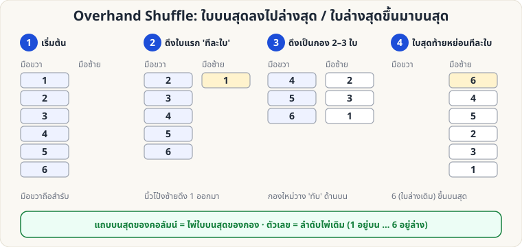
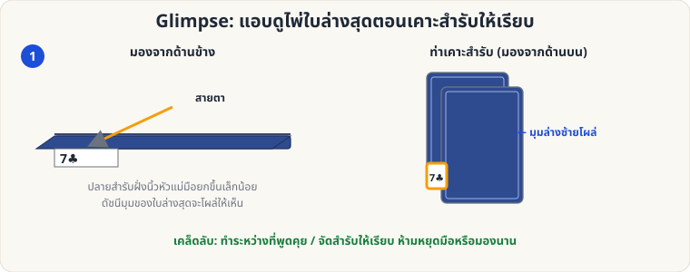
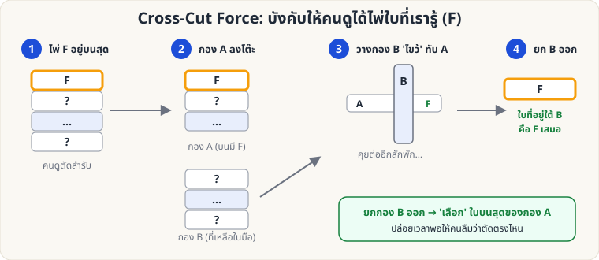

# ไพ่ฝีมือ — 🟢 ระดับง่าย

[← หน้าหลัก](Home.md) · [ไประดับกลาง →](Sleight-Medium.md)

> ทุกท่าฝึกก่อนหน้ากระจก: **ช้า → ถูก → เนียน → เร็ว**

---

## 1. Overhand Shuffle (สับแบบสับมือ)

**จุดประสงค์:** สับไพ่ให้ดูจริง และเรียนรู้การ **คุมตำแหน่งไพ่** (นี่คือรากฐานของการควบคุมไพ่เกือบทั้งหมด)

**ท่าพื้นฐาน**

1. มือขวาถือสำรับจากด้านบน (นิ้วโป้งที่ขอบด้านหนึ่ง นิ้วที่เหลืออีกด้านหนึ่ง) สำรับคว่ำ
2. นิ้วโป้งซ้ายแตะ **ด้านบนสุด** ของสำรับในมือขวา แล้วดึงไพ่ออกเป็นกองเล็ก ๆ ลงบนฝ่ามือซ้าย
3. กองถัดไป **วางทับ** กองก่อนหน้า ทำจนสำรับหมดมือขวา

**หลักที่ต้องจำ (ใช้ควบคุมไพ่)**

| ต้องการ | ทำอย่างไร |
|---|---|
| ส่ง **ใบบนสุด → ล่างสุด** | ดึงใบบนสุด **ทีละใบเดี่ยว ๆ** เป็นการดึงครั้งแรก แล้วที่เหลือสับต่อ |
| ส่ง **ใบล่างสุด → บนสุด** | สับตามปกติ แต่ปล่อยใบสุดท้ายในมือขวา **ทีละใบเดี่ยว ๆ** ลงบนสุด |

ในภาพ: ใบ 1 (บนสุด) ถูกดึงก่อนจึงอยู่ล่างสุด ส่วนใบ 6 (ล่างสุด) ถูกปล่อยท้ายสุดจึงขึ้นบนสุด

**ข้อผิดพลาดที่พบบ่อย**

- ดึงกองใหญ่/เล็กสลับสม่ำเสมอเกินไป → ดูเหมือนฝึกมา ให้ขนาดกองไม่เท่ากัน
- จ้องมือ → มองหน้าผู้ชมแล้วพูดคุยไปด้วย

---

## 2. Glimpse (แอบดูไพ่ล่างสุด)

**จุดประสงค์:** รู้ว่าไพ่ใบล่างสุด (หรือใบที่ต้องการ) คืออะไรโดยไม่มีใครรู้ — ใช้กับ [ไพ่คีย์](Self-Working-Easy.md#keycard) และ [Si Stebbins](Self-Working-Medium.md#stebbins)

**วิธีทำ**

1. ถือสำรับในท่า Dealing Grip หรือคว่ำบนฝ่ามือ
2. ขณะ **เคาะสำรับให้เรียบ** (หรือจัดสำรับ) ยกปลายด้านนิ้วโป้งขึ้นเล็กน้อย
3. มุมดัชนีของใบล่างสุดจะโผล่ให้เห็น ชำเลืองสั้น ๆ ไม่เกิน 1 วินาที
4. กลับสู่ท่าปกติ แล้วพูดต่อ

**เคล็ดลับ**

- ทำตอน "ชวนคุย" หรือคิดว่าจะแจกไพ่ ไม่ต้องหยุดการเคลื่อนไหว
- ฝึกแล้วจำให้ได้ ไม่ต้องเพ่ง: มองแว่บเดียว บอกชื่อไพ่ได้
- ซ้อมกับสำรับที่ดัชนีใหญ่ → แล้วค่อยเปลี่ยนเป็นสำรับธรรมดา

---

## 3. Cross-Cut Force (บังคับไพ่ด้วยการตัดไขว้)

**ผลที่ผู้ชมเห็น:** ผู้ชมเลือกจุดตัดสำรับ "เองโดยอิสระ" แต่ได้ไพ่ F ใบที่คุณรู้อยู่แล้ว

**อุปกรณ์:** สำรับที่ไพ่ F อยู่บนสุด (ใช้ [Overhand](#overhand) หรือ [Glimpse](#glimpse) เพื่อรู้/ควบคุมใบบนสุด)

**วิธีทำ**

1. F อยู่บนสุดของสำรับคว่ำ ให้ผู้ชม **ตัดสำรับบางส่วนลงโต๊ะ** (กอง A — F อยู่บนสุดของ A)
2. คุณวางไพ่ส่วนที่เหลือ (กอง B) **ไขว้** ทับบนกอง A ขณะพูดอะไรบางอย่าง
3. คุยเรื่องอื่นสักพัก (ผู้ชมจะลืมว่าตัดตรงไหน)
4. "ตรงจุดที่คุณตัด" — ยกกอง B ออก แล้ว **หยิบไพ่ใบบนสุดของกอง A** → นั่นคือ F
5. ให้ผู้ชมดู จำ แล้วคืนเข้าสำรับ

**เคล็ดลับ**

- ต้องมีเวลาคั่นระหว่างขั้น 3–4 (อย่างน้อยก็สักประโยคหรือสองประโยค)
- อย่าเรียกว่า "บังคับ" ให้ผู้ชมรู้สึกว่าเป็นอิสระเต็มที่ ("ตัดตรงไหนก็ได้ ตามสบายเลย")
- เหมาะใช้เป็นขั้นตอนแรกของกลอ่านใจ/ทำนายต่าง ๆ

---

ต่อไป: [ระดับกลาง →](Sleight-Medium.md)
