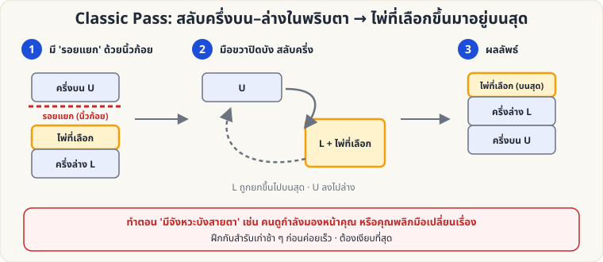
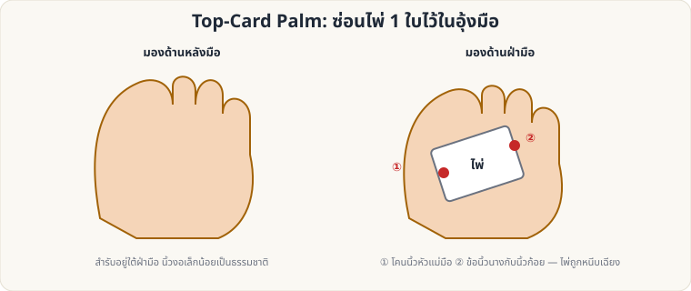
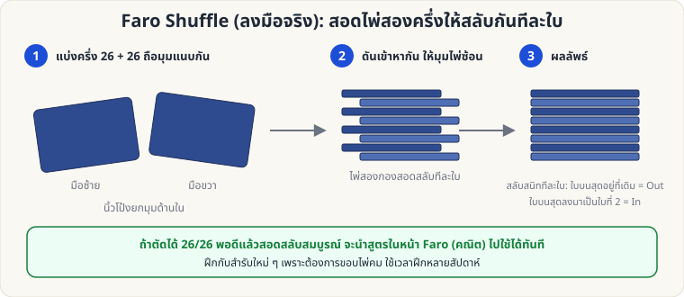

# ไพ่ฝีมือ — 🔴 ระดับยาก

[← ระดับกลาง](Sleight-Medium.md) · [หน้าหลัก](Home.md)

ท่าในระดับนี้ต้องใช้เวลาฝึก **หลายสัปดาห์ถึงหลายเดือน** และควรฝึกกับสำรับเก่า ควรมีผู้สอนหรือวิดีโอประกอบ

---

## 1. Classic Pass (สลับครึ่งสำรับ)

**จุดประสงค์:** พาไพ่ที่ผู้ชมเลือกขึ้นมาอยู่ **บนสุด** ของสำรับในพริบตา โดยไม่ให้ผู้ชมรู้ว่ามีการเคลื่อนไหว

**ขั้นตอนหลัก**

1. ผู้ชมเลือกไพ่ แล้วคุณให้คืน **ใบบนสุดของครึ่งล่าง (L)** ขณะที่คุณถือ **รอยแยก (Break)** ด้วยนิ้วก้อยซ้าย — รอยแยกอยู่ **ระหว่างครึ่งบน U และไพ่ที่เลือก**
2. จัดสำรับในมือซ้าย มือขวาครอบด้านบน/ด้านนอกของสำรับเพื่อบังสายตา
3. **มือซ้ายปล่อยครึ่งล่าง L** (พร้อมไพ่ที่เลือก) ให้หมุนขึ้นไปบนสุด ขณะที่ **ครึ่งบน U** ถูกดึงลงล่าง — สลับกันในพริบตา (ต้องบังด้วยมือขวา)
4. เมื่อจบ ไพ่ที่เลือกอยู่ **บนสุด** ของสำรับ พร้อมต่อกับท่าอื่น เช่น Double Lift หรือ Ambitious Card

**ฝึกอย่างไร**

- ฝึกช้า ๆ กับสำรับเก่าก่อน ให้ "ปิดสนิท" แล้วค่อยเร่งความเร็ว
- ให้เพื่อนดูมุมด้านข้าง หรือถ่ายวิดีโอสโลว์โมชั่นดูสิ่งที่ผู้ชมเห็น
- อย่า "รีบ" ให้ท่าเดียวเสร็จในจังหวะที่ **คนดูกำลังมองหน้าคุณ**

**ข้อควรระวัง:** ถ้าเสียงดังหรือไพ่เอียง ผู้ชมจะรู้ทันที — ท่านี้ต้อง "เงียบ" ที่สุด

---

## 2. Top-Card Palm (ซ่อนไพ่ใบบนสุดในอุ้งมือ)

**ผลที่ผู้ชมเห็น:** ไพ่ใบหนึ่ง "หายไป" จากสำรับ แล้วไปโผล่ที่อื่น (กระเป๋า, กล่อง, เสื้อ ฯลฯ)

**ขั้นตอนหลัก**

1. สำรับในมือซ้าย (Dealing Grip) ผู้ชมยังเห็นไพ่ใบบนสุด
2. มือขวาวางครอบสำรับ แล้ว **ดึงไพ่ใบบนสุด** ไปด้านหลังเล็กน้อยด้วยนิ้วโป้งซ้าย (ใช้ Pinky Break ช่วยหาใบ)
3. ใช้ **โคนนิ้วโป้งขวา (①)** และ **ข้อนิ้วนางกับนิ้วก้อย (②)** หนีบไพ่ไว้ตามแนวเฉียงในฝ่ามือ
4. นิ้วมือต้อง **ผ่อนคลายและงอตามธรรมชาติ** — ห้ามกำแน่น หรือกางนิ้วผิดสังเกต
5. ใช้มือที่ถือไพ่ไปทำอย่างอื่น เช่น หยิบกระเป๋า วางไพ่ลง (ปล่อยไพ่ตอนมือเข้าไปในกระเป๋า)

**ข้อควรระวัง**

- หลีกเลี่ยงท่าทางผิดธรรมชาติ (มือแข็ง นิ้วแน่นผิดปกติ)
- ใช้ **Misdirection**: ให้ผู้ชมมองมืออีกข้างหนึ่งหรือหน้าคุณ
- ฝึกให้ผ่อนคลายจนทำได้ระหว่างพูดคุยโดยไม่ต้องคิด

---

## 3. Faro Shuffle (ลงมือจริง)

**จุดประสงค์:** สอดไพ่สองครึ่งให้สลับกันทีละใบ **สมบูรณ์** เพื่อควบคุมตำแหน่งไพ่ทั้งสำรับ (ใช้ร่วมกับ [สูตรคณิตศาสตร์ Faro](Self-Working-Hard.md))

**ขั้นตอนหลัก**

1. **แบ่งสำรับ 26/26 พอดี** — นับ หรือคุ้นเคยกับความหนา (ฝึกจนตัดได้แม่น)
2. ถือแต่ละครึ่งในมือคนละข้าง ให้ **มุมด้านในชิดกัน** นิ้วโป้งยกมุมขึ้นเล็กน้อย
3. **ดันสองครึ่งเข้าหากัน** ให้มุมไพ่ซ้อนสอดสลับทีละใบ (ใช้แรงนิ้วชี้กดมุมบนไว้ไม่ให้ไพ่เด้ง)
4. **ดันให้สุด** แล้วเรียบสำรับ — ได้สำรับที่สอดสลับสมบูรณ์

**Out vs In**

- **Out-shuffle:** ใบบนสุดอยู่ที่เดิม
- **In-shuffle:** ใบบนสุดลงมาเป็นใบที่ 2

**ข้อควรระวัง**

- ต้องใช้ **สำรับใหม่/ขอบคม** ไพ่เก่าหรือโค้งงอทำไม่ได้
- ผิดพลาดบ่อยจนกว่าจะฝึกหลายสัปดาห์ — อดทน
- ตรวจผลด้วยการทำ Out-shuffle 8 ครั้งติด: ถ้าสำรับกลับเป็นลำดับเดิม แสดงว่าสอดสมบูรณ์ทุกครั้ง

---

กลับไป [หน้าหลัก](Home.md)
