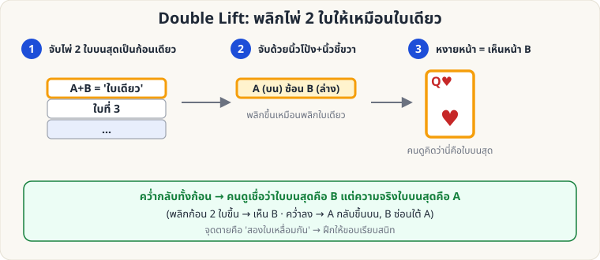
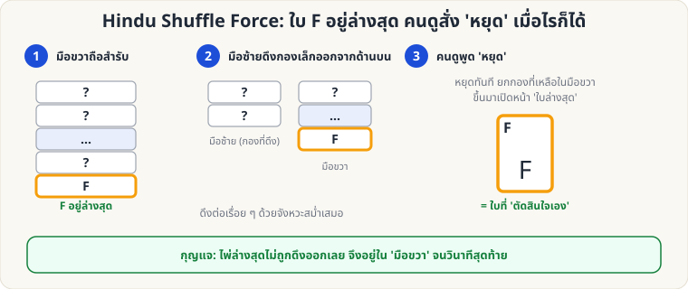
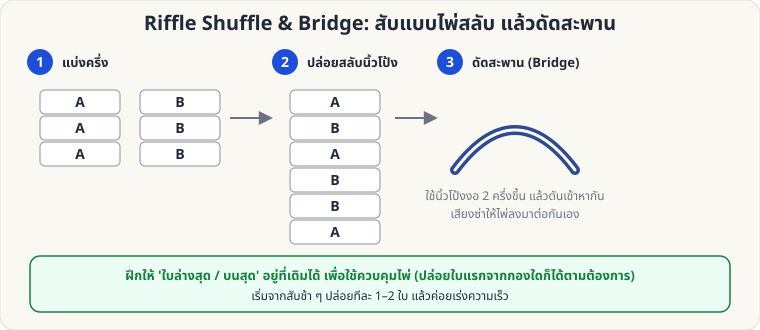

# ไพ่ฝีมือ — 🟡 ระดับกลาง

[← ระดับง่าย](Sleight-Easy.md) · [หน้าหลัก](Home.md) · [ไประดับยาก →](Sleight-Hard.md)

---

## 1. Double Lift (พลิกไพ่ 2 ใบให้เป็นใบเดียว)

**ผลที่ผู้ชมเห็น:** คุณพลิกไพ่ "ใบบนสุด" ให้ดู แล้วคว่ำกลับ — ผู้ชมเชื่อว่าใบนั้นอยู่บนสุดของสำรับจริง ๆ

**หลักการ:** ไพ่ 2 ใบเรียงซ้อนตรงกัน ถูกพลิกเป็น "ใบเดียว" หน้าที่เห็นคือใบที่ **2 จากบน (B)** แต่ใบบนสุดจริงคือ **A**

**วิธีทำ (ท่าพื้นฐาน)**

1. สำรับคว่ำในท่า Dealing Grip
2. ใช้นิ้วโป้งซ้ายดันไพ่ **2 ใบบนสุด** ไปทางขวาเล็กน้อย ให้ขอบเรียงตรงกันเป็นก้อนเดียว (ใช้ [Pinky Break](#pinkybreak) ช่วยแบ่งตำแหน่ง 2 ใบ)
3. มือขวาจับมุมด้านที่ไกลจากตัวคุณ (นิ้วโป้งด้านใน นิ้วอื่นด้านนอก) แล้ว **พลิกก้อน 2 ใบหงายขึ้น** เหมือนพลิกไพ่ใบเดียว ผู้ชมเห็นหน้าไพ่ B
4. **คว่ำก้อนกลับ** วางบนสำรับ — A กลับขึ้นบนสุดตามเดิม (B ซ่อนอยู่ใต้ A)
5. หยิบ **ใบบนสุดจริง (A)** ออกไปวางแยก โดยเรียกมันว่า "B" — ผู้ชมเชื่อว่าเป็นใบที่เพิ่งเห็น แล้วทำให้มัน "เปลี่ยน/หาย/โผล่ที่อื่น" ด้วยกลต่อไป (เช่น Ambitious Card)

**เคล็ดลับ**

- ความตึงของไพ่ 2 ใบต้อง **เท่ากับไพ่ใบเดียว** (อย่าถือหลวม/แน่นเกิน)
- เมื่อพลิก ให้ท่ามือ **เหมือนพลิกใบเดียว** ทุกจังหวะ
- ฝึกด้วยไพ่ที่ต่างสีกัน 2 ใบ เพื่อสังเกตว่า "เห็นเท่าไร"

---

## 2. Pinky Break และ Hindu Shuffle Force

### 2.1 Pinky Break (ช่องว่างนิ้วก้อย)

ใช้ปลายนิ้วก้อยซ้ายแง้มไพ่ที่ **ด้านหลังขอบสำรับ** ให้เกิดช่องเล็ก ๆ เพื่อ "จำตำแหน่ง" โดยไม่ต้องมอง — ใช้กับ Double Lift, Pass, Palm และท่าอื่น ๆ ฝึกให้ช่องกว้าง **1–2 มม.** และไม่เห็นจากด้านหน้า

### 2.2 Hindu Shuffle Force

**ผลที่ผู้ชมเห็น:** คุณสับสำรับด้วยท่า Hindu Shuffle ผู้ชมสั่ง "หยุด" ตอนไหนก็ได้ แล้วหยิบไพ่ใบนั้น ซึ่งก็คือ F ที่คุณรู้อยู่แล้ว

**อุปกรณ์:** สำรับที่ F อยู่ **ล่างสุด** (ใช้ [Overhand](Sleight-Easy.md#overhand) ส่ง F ลงล่าง หรือ [Glimpse](Sleight-Easy.md#glimpse) หาไพ่ล่างสุด)

**วิธีทำ**

1. มือขวาถือสำรับจากด้านบน (ท่าเดียวกับ Overhand) มือซ้ายอยู่ข้างล่าง
2. มือซ้าย **ดึงกองเล็ก ๆ จากด้านบนสุด** ของสำรับในมือขวา ลงในมือซ้าย กองถัดไปวางทับ
3. บอกผู้ชมว่า "สั่งหยุดเมื่อไรก็ได้ตามใจ"
4. เมื่อผู้ชมสั่งหยุด **ปล่อยกองที่เหลือในมือขวา** ยกขึ้นด้านหน้าแล้ว **เปิดไพ่ใบล่างสุดของกองนั้น** = F
5. ผู้ชมเชื่อว่าเขาเป็นผู้หยุดให้ตรงใบนั้น

**เคล็ดลับ**

- จังหวะดึงต้องสม่ำเสมอ ผู้ชมต้องไม่รู้ว่าใบล่างสุดไม่เคยถูกดึง
- ถ้าผู้ชมไม่หยุดเลย ให้เล่นต่อจน "เหลือแต่ F" แล้วบอกว่า "ผู้ชมตัดสินใจช้าจัง!"

---

## 3. Riffle Shuffle และ Bridge

**จุดประสงค์:** สับให้ดูแบบมืออาชีพ และเป็นพื้นฐานของ Faro Shuffle

**วิธีทำ**

1. แบ่งสำรับเป็น 2 ครึ่ง วางบนโต๊ะ (หรือถือในมือทั้งสอง) ให้มุมด้านในชิดกัน
2. ใช้นิ้วโป้งทั้งสองดัดมุมไพ่ ปล่อยให้ไพ่ **ลื่นไหลตกลงมาสลับกัน** (ปล่อยทีละใบ หรือ 2–3 ใบ)
3. **Bridge:** ดันสองครึ่งเข้าหากัน ให้ไพ่โค้ง "สะพาน" ขึ้นด้านบน แล้วปล่อยให้ไพ่ตกลงมาเรียบร้อยด้วยแรงนิ้วโป้ง

**การควบคุม**

- ถ้าต้องการให้ **ใบล่างสุดยังอยู่ล่างสุด** ให้ปล่อยไพ่จากครึ่งล่างก่อน
- ถ้าต้องการให้ **ใบบนสุดอยู่บนสุด** ให้ปล่อยไพ่ใบสุดท้ายจากครึ่งบนทีหลัง

**ข้อควรระวัง:** ถ้าฝึกไม่พอ ไพ่จะ "กระเด็น" — ฝึกบนโต๊ะผ้าก่อน

---

ต่อไป: [ระดับยาก →](Sleight-Hard.md)
